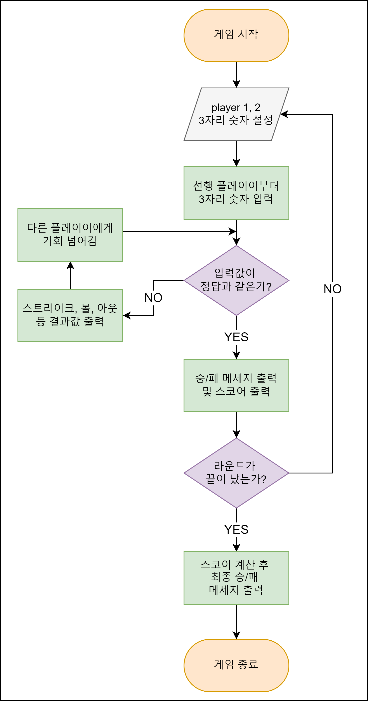

# Hybus-Smart4412를 이용한 숫자 야구 게임

## 소개
한경대학교 **IoT 프로그래밍** 수업에서 진행된 프로젝트로, **Hybus-Smart4412** 보드와 **리눅스**, **C 언어**를 활용하여 개발한 숫자 야구 게임입니다.

## 개발 기간
2024.5 ~ 2024.6

**4조 팀원**:
- **김태민**
- **김수영**
- **김주원**
- **박건희**

## 게임 시스템

숫자 야구 게임은 다음과 같은 단계로 진행됩니다:

1. **비밀 번호 설정**:
   - **플레이어**: 두 명의 플레이어가 게임을 진행합니다.
   - **첫 번째 라운드**: 3자리 숫자를 설정합니다.
   - **두 번째 라운드**: 4자리 숫자를 설정합니다.
   - **중복 방지**: 비밀 번호의 각 자리는 중복되지 않아야 합니다.

2. **숫자 추측**:
   - **스트라이크**: 추측한 숫자 중 자리와 숫자가 모두 맞는 경우.
   - **볼**: 추측한 숫자 중 숫자만 맞고 자리는 틀린 경우.
   - **아웃**: 추측한 숫자가 모두 틀린 경우.
   - **홈런**: 추측한 숫자가 모두 맞는 경우.

3. **게임 진행**:
   - **라운드**: 두 플레이어가 번갈아 가며 1부터 9까지의 숫자를 입력해가며 추측합니다.
   - **승리 조건**: 스트라이크 수가 비밀 번호의 길이와 같으면 그 라운드에서 해당 플레이어가 승리합니다.
   - **최종 승리**: 점수 계산법에 따라 더 높은 스코어를 가지고 있는 플레이어가 최종 승리를 하게 됩니다.

4. **점수 계산**:
   - **시작 점수**: 각 플레이어는 1000점으로 시작합니다.
   - **점수 차감**: 추측 실패 시마다 10점이 깎이고, 추측에 걸린 시간에 따라 초당 1점이 추가로 깎입니다.
   - **라운드 결산**: 두 라운드 동안의 점수 차감값을 바탕으로 최종 승리자를 가립니다.

## 외부 입출력 장치 기능

### CLCD (Character LCD)
- **초기화**: CLCD를 초기화하고, 화면을 지웁니다.
- **문구 표시**: 게임 진행 상황을 CLCD에 표시합니다.
  - 예: 환영 문구, 현재 라운드, 플레이어의 숫자 입력 등을 표시합니다.

### Dot Matrix
- **초기화**: Dot Matrix를 초기화하고, 모든 LED를 꺼둡니다.
- **아이콘 및 상태 표시**: 
  - **BASEBALL 문자**: 처음 Dip Switch를 올려 게임을 시작할 때 BASEBALL 문자를 순차적으로 출력합니다.
  - **상태 표시**: 입력한 숫자에 따른 스트라이크('S'), 아웃('O'), 홈런('H'), 볼('B') 상태를 Dot Matrix에 잠시 표시합니다.
  - `BASEBALL_ICON`: 처음 Dip Switch를 올려 게임을 시작할 때 BASEBALL 문자를 순차적으로 출력.
  - `STRIKE`: 스트라이크 상태 패턴.
  - `OUT`: 아웃 상태 패턴.
  - `HOME_RUN`: 홈런 상태 패턴.
  - `BALL`: 볼 상태 패턴.

### FND (7-Segment Display)
- **초기화**: FND를 초기화하고, 모든 세그먼트를 꺼둡니다.
- **숫자 표시**: 플레이어가 입력한 숫자, 게임 결과 점수 등을 FND에 표시합니다.

### Tact Switch
- **입력 읽기**: Tact Switch의 상태를 읽어 입력을 처리합니다.
  - **숫자 입력**: 0부터 9까지의 숫자를 입력할 수 있습니다.
  - **엔터 입력**: Tact Switch 10은 게임 실행을 위한 엔터처럼 처리됩니다. Tact Switch를 이용해서 숫자를 입력하고 10을 누르면 해당 숫자가 input이 됩니다.
  - **종료 입력**: Tact Switch 12를 입력하면 게임이 종료됩니다.

### LED
- **제어**: 게임 상황에 따라 LED를 켜고 끕니다.
  - **게임 시작 전 LED 깜빡임**: Dip Switch를 올려 게임을 시작할 때 모든 LED를 깜빡입니다.
  - **게임 종료 후 LED 깜빡임**: 게임이 끝나고 스코어가 뜨면 잠시 동안 모든 LED를 깜빡입니다. 
  - LED 제어 예시:
    - `LED_RED_0`, `LED_RED_4`: 아웃일 경우 빨간색 LED가 깜빡입니다.
    - `LED_GREEN_1`, `LED_GREEN_5`: 스트라이크일 경우 초록색 LED가 깜빡입니다.
    - `LED_YELLOW_2`, `LED_YELLOW_6`: 볼일 경우 노란색 LED가 깜빡입니다.
    - `LED_BLUE_3`, `LED_BLUE_7`: 홈런일 경우 파란색 LED가 깜빡입니다.

### Dip Switch
- **게임 시작**: Dip Switch를 올리면 게임이 시작됩니다.

## 주요 기능 설명

- **Dip Switch 사용**: 게임 시작을 위한 입력으로 사용합니다.
- **초기화**: 각 장치를 초기화하고, 시작 상태로 설정합니다.
- **CLCD 사용**: 게임의 진행 상황을 CLCD에 표시합니다.
- **Dot Matrix 사용**: 게임 상태를 Dot Matrix에 표시합니다.
- **FND 사용**: 플레이어의 숫자 입력 및 게임 점수를 FND에 표시합니다.
- **Tact Switch 사용**: 플레이어의 입력을 받아 처리합니다.
- **LED 사용**: 특정 상황(예: 홈런)에서 LED를 제어합니다.
- **게임 로직**: 두 플레이어가 번갈아 가며 숫자를 추측하고, 스트라이크와 볼을 계산하여 점수를 기록하고, 최종 승자를 결정합니다.

## 게임 플로우차트

## 시연 영상

편집된 영상: [https://youtu.be/2-bPniCmVw4](https://youtu.be/2-bPniCmVw4)

무편집 영상: [https://youtu.be/fU27BnqnGxc](https://youtu.be/fU27BnqnGxc)

